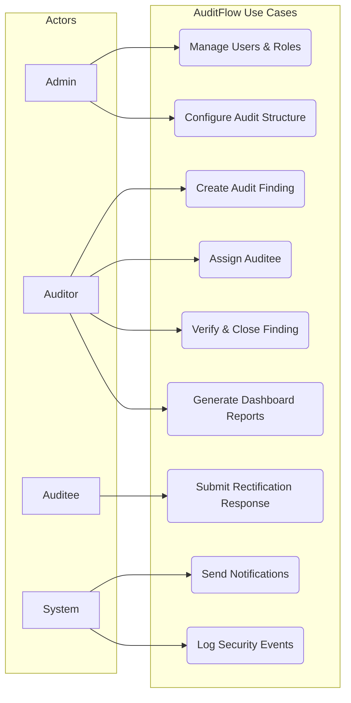
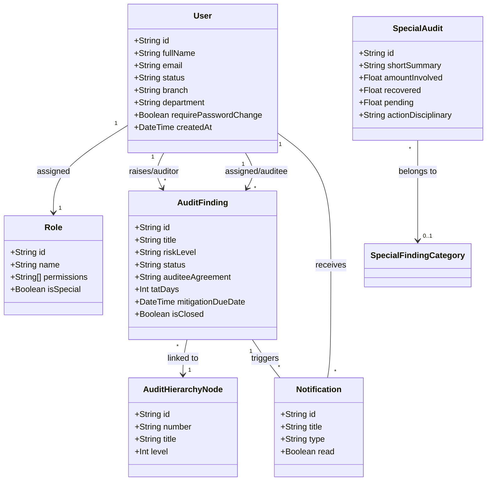
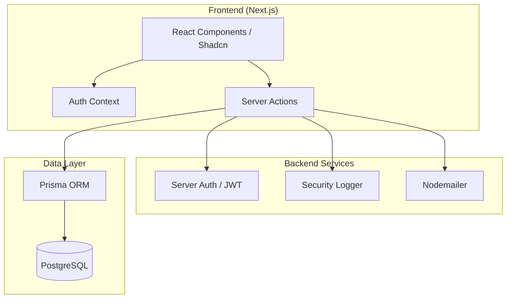

# Low Level Design (LLD) - AuditFlow

## 1. Introduction

### 1.1 Purpose of the LLD Document
The purpose of this Low Level Design (LLD) document is to provide a detailed technical specification for the **AuditFlow** system. It translates high-level requirements into a granular design that guides developers in implementing the system's components, data structures, and interactions.

#### 1.1.1 In Scope Features
- **User Authentication & Authorization**: Multi-role access control (Admin, Auditor, Auditee) with secure session management and password policies.
- **Audit Hierarchy Management**: Dynamic configuration of audit units (Branches, Departments, Districts).
- **Findings Management**: End-to-end workflow for creating, assigning, responding to, and tracking audit findings.
- **Special Audits**: Targeted auditing for specific individuals or high-risk cases.
- **Notifications**: Real-time and email-based alerts for critical audit milestones and deadlines.
- **Security Logging**: Comprehensive auditing of system actions for compliance and security monitoring.
- **Reporting**: Generation of consolidated and frequency-based audit reports.

#### 1.1.2 Out-of-Scope
- **HR Payroll Integration**: Managing employee salaries or payroll processing.
- **External Financial Auditing**: Integration with external regulatory banking systems (unless specified via export).
- **Offline Mode**: The system requires an active internet connection for database and session synchronization.

#### 1.1.3 Assumptions and Constraints
- **Database**: The system assumes a PostgreSQL database is available.
- **Hosting**: Designed for deployment on modern cloud platforms (e.g., Firebase App Hosting, Vercel).
- **Security**: Relies on environment variables for sensitive secrets (DB URLs, JWT keys).
- **Browser Compatibility**: Optimized for modern evergreen browsers (Chrome, Firefox, Safari, Edge).

#### 1.1.4 Audience for the Document
This document is intended for software developers, system architects, QA engineers, and project stakeholders involved in the technical delivery of AuditFlow.

### 1.2 Significance of The project
AuditFlow streamlines the traditionally manual and fragmented auditing process. By centralizing findings, automating notifications, and providing real-time dashboards, it reduces operational risk, ensures compliance with internal policies, and accelerates the resolution of identified audit gaps.

### 1.3 System Design and Analysis

#### 1.3.1 Development Environment
- **Operating System**: Windows/macOS/Linux
- **Runtime**: Node.js (v20+)
- **Package Manager**: npm

#### 1.3.2 Development Tools
- **Framework**: Next.js 15 (App Router)
- **Language**: TypeScript
- **ORM**: Prisma
- **Styling**: Tailwind CSS with Shadcn UI components
- **Testing**: Jest, React Testing Library
- **IDE**: VS Code / Trae

#### 1.3.3 Testing Procedures
- **Unit Testing**: Testing individual utility functions and server actions using Jest.
- **Integration Testing**: Verifying the interaction between server actions and the Prisma database.
- **End-to-End Testing**: (Planned) Simulating user flows from login to finding resolution.

### 1.5 Acronyms and Definitions
- **LLD**: Low Level Design
- **ORM**: Object-Relational Mapping
- **JWT**: JSON Web Token
- **TAT**: Turnaround Time
- **CUID**: Collision-resistant Unique Identifier

## 2. System Functionality Overview
AuditFlow provides a comprehensive suite for managing internal audits. It allows administrators to manage users and system settings, auditors to raise and track findings, and auditees to respond and provide evidence of rectification. The dashboard provides high-level insights into risk levels, departmental performance, and pending actions.

## 3. Detailed Design

### 3.1 Use Case Diagram
The following diagram illustrates the primary interactions between users (Actors) and the AuditFlow system.

### 3.2 Description of the Component

#### 3.2.1 Login Component
- **Purpose**: Authenticates users and establishes secure sessions.
- **Logic**:
  - Validates input using Zod schemas.
  - Implements rate limiting and account lockout (5 failed attempts).
  - Verifies hashed passwords using `bcrypt`.
  - Sets secure, HTTP-only cookies for JWT access and refresh tokens.
  - Logs `AUTH_LOGIN_SUCCESS` or `AUTH_LOGIN_FAILURE` events.

#### 3.2.2 Register Admin
- **Purpose**: Initializes the system with a primary administrator.
- **Implementation**: Typically handled via a `prisma/seed.ts` script or a one-time onboarding route that creates the first user with the 'Admin' role.

#### 3.2.3 Register Internal User
- **Purpose**: Allows Admins to add staff members (Auditors/Auditees).
- **Logic**:
  - Admin enters user details (Name, Email, Role, Branch/Dept).
  - System generates a temporary password.
  - Sends invitation email via `nodemailer`.
  - Sets `requirePasswordChange: true` to force update on first login.

#### 3.2.4 Add Customer (Audit Unit Onboarding)
- **Purpose**: Establishes new organizational units within the system for auditing purposes.
- **Description**: In the context of AuditFlow, a "Customer" is defined as an audit-eligible unit, such as a **Branch**, **Department**, or **District**.
- **Logic**:
  - The `AddEditBranchDialog` or `AddEditDepartmentDialog` components capture unit details.
  - Data is persisted via server actions (`createBranch`, `createDepartment`) in `src/app/actions/settings.ts`.
  - These units are then available in the `CreateFindingForm` for linking findings to specific organizational entities.

#### 3.2.5 Manage Customer Status (Account & Unit Lifecycle)
- **Purpose**: Governs the operational state of users and audit units.
- **Logic**:
  - **User Status**: Admins can toggle a user's status between `Active` and `Inactive` via the `EditUserDialog`. Inactive users are immediately barred from system access, and their active sessions are invalidated.
  - **Unit Status**: Audit units (Branches/Departments) can be managed to reflect restructuring. While data remains for historical reporting, inactive units are filtered out from new finding assignments.

### 3.3 Class Diagram
The following class diagram represents the core data entities and their relationships within AuditFlow.

#### **User**
Represents a system user (Admin, Auditor, or Auditee).
- `id: String` (PK, CUID) - Unique identifier for the user.
- `fullName: String` - User's legal name.
- `email: String` (Unique) - Login credential and notification target.
- `password: String` - Hashed password string.
- `roleId: String` (FK) - Reference to the user's role.
- `status: String` - Current account status (e.g., "Active", "Inactive").
- `branch: String?` - Optional branch assignment.
- `department: String?` - Optional department assignment.
- `district: String?` - Optional district assignment.
- `requirePasswordChange: Boolean` - Flag to force password update.
- `passwordLastChanged: DateTime` - Timestamp of last password modification.
- `createdAt: DateTime` - Record creation timestamp.

#### **AuditFinding**
The central entity for tracking audit issues.
- `id: String` (PK, CUID) - Unique identifier.
- `title: String` - Short summary of the finding.
- `details: String` - In-depth description of the audit gap.
- `riskLevel: String` - Severity of the finding (High, Medium, Low).
- `branchOrDepartment: String` - The specific unit being audited.
- `recommendation: String` - Suggested corrective action.
- `status: String` - Workflow state (Open, Mitigated, Closed).
- `auditeeAgreement: String` - Auditee's stance (Agreed, Disagreed, Partial).
- `assignedDate: DateTime?` - Date finding was assigned.
- `tatDays: Int` - Turnaround time in days for resolution.
- `rectificationDate: DateTime?` - Date the finding was resolved.
- `auditorId: String?` (FK) - User who raised the finding.
- `auditeeId: String?` (FK) - User responsible for responding.
- `hierarchyNodeId: String` (FK) - Reference to the audit structure node.

#### **Role**
Defines system access levels.
- `id: String` (PK, CUID) - Unique identifier.
- `name: String` (Unique) - Role name (Admin, Auditor, Auditee).
- `description: String` - Explanation of role responsibilities.
- `permissions: String[]` - Array of granular permission keys.

#### **SpecialAudit**
Captures high-profile or sensitive audit cases.
- `id: String` (PK, CUID) - Unique identifier.
- `shortSummary: String` - Brief overview.
- `amountInvolved: Float` - Financial impact.
- `recovered: Float` - Amount already recovered.
- `pending: Float` - Amount still outstanding.
- `actionDisciplinary: String` - Disciplinary measures taken.
- `categoryId: String?` (FK) - Reference to special category.

#### **AuditHierarchyNode**
Represents the structural level within the audit plan.
- `id: String` (PK, CUID) - Unique identifier.
- `parentId: String?` (FK) - Self-relation for parent node.
- `level: Int` - Depth in the hierarchy tree.
- `number: String` (Unique) - Reference number (e.g., "1.2.3").
- `title: String` - Name of the node.
- `customFields: Json?` - Flexible metadata for specific nodes.

#### **Notification**
- `id: String` (PK, CUID)
- `userId: String` (FK) - Recipient of the notification.
- `title: String` - Notification header.
- `message: String` - Detailed alert content.
- `type: String` - Severity level (info, warning, alert).
- `read: Boolean` - Flag for read status.
- `findingId: String?` (FK) - Link to related finding.

### 3.4 Component Diagram
The diagram below shows the high-level architecture and how the various technical components of AuditFlow interact.

## 4. Testing

### 4.1 Unit Testing
Focused on pure functions and business logic.
- **Password Utils**: Testing hashing and verification.
- **Permission Logic**: Verifying role-based access control (RBAC).
- **Schema Validation**: Ensuring Zod schemas catch invalid inputs.

### 4.1.2 Integration Testing
Testing the flow between components.
- **Auth Flow**: Mocking Prisma to test login/logout logic.
- **Finding Lifecycle**: Verifying that creating a finding correctly triggers notifications and DB records.

### 4.1.3 System Testing
End-to-end verification of features.
- **Dashboard Data**: Ensuring charts reflect actual DB counts.
- **Report Generation**: Verifying PDF/Excel exports contain correct data.

### 4.1.4 Acceptance Testing
Validating against user requirements.
- **User Stories**: "As an Auditor, I can raise a finding and assign it to a Branch Manager."
- **Performance**: Ensuring page loads and API responses meet latency targets.

## 5. Deployment
- **Platform**: Firebase App Hosting / Vercel.
- **Database**: Managed PostgreSQL (e.g., Supabase, RDS).
- **Environment Variables**: Managed via platform secrets (e.g., `.env.production`).
- **Build Pipeline**: GitHub Actions for automated linting, testing, and deployment.

## 6. Reference
- [Next.js Documentation](https://nextjs.org/docs)
- [Prisma Documentation](https://www.prisma.io/docs)
- [Shadcn UI](https://ui.shadcn.com/)
- Project Source Code: [serverAuth.ts](file:///c:/Projects/AuditFlow/src/lib/serverAuth.ts), [schema.prisma](file:///c:/Projects/AuditFlow/prisma/schema.prisma)
